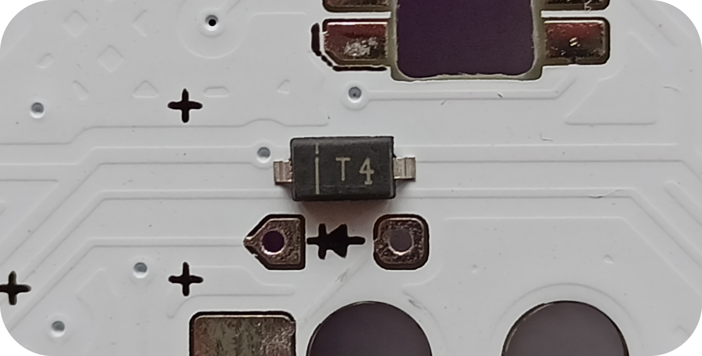
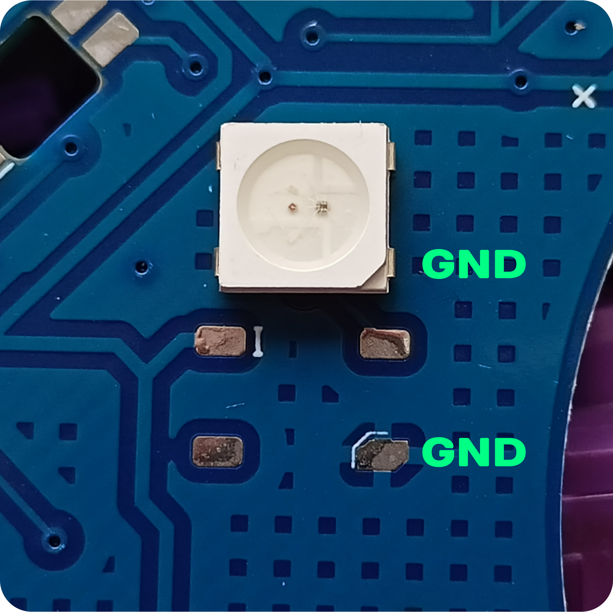

# Jaye 44 билдгайд

### Необходимые детали

| Название        | Количество | Примечание | 
| :---------------- | :---: | :------ |
| PCB        | 2 |  | 
| Плейт       | 2 |  |
| Бэкплейт        | 2 |  |
| Шилдик| 2 |  |
| MX hot-swap сокеты    | 44 |  |
| 1N4148W диоды | 44 |  |
| Top-mount Type-C  | 2 |  |
| WS2812B 5050 светодиод| 2 |  |
| RP-2040 Zero | 2 |  |
| M2 5 мм винты | 12 |  |
| M2 7 мм стойки | 4 |  |
| M2 8 мм стойки | 2 |  |

Рекомендуется при пайке иметь так же флюс и инструмент по удалению припоя (например медная косичка), для минимизации ошибок.

## Диоды
Рекомендованная температура пайки: 230-280°С

Диоды необходимо паять на нижней стороне ПЦБ в правильной ориентации. 
На посадочном месте есть указатель в виде изображения диода, а так же на паде в виде конуса. Это направление диода. 
Диод должен быть расположен в ориентации как показано на картинке.

 
 
Добавьте припоя на один из падов и паяйте диод используя пинцет. Теперь распайте второй пад.

## Хот-свап сокеты
Рекомендованная температура пайки: 230-280°С

Здесь используется такой же метод пайки как и в диодах.
Перед пайкой убедидесь, что сокет не перекрывает центральное отверстие свитча!

 

## USB Type-C
Рекомендованная температура пайки: 260-290°С
На этом этапе пайки можно легко ошибиться, поэтому лучше иметь при себе медную косичку или оловотсос.

Добавьте флюса на пады и внутри отверстий под крепление, это можно сделать зубочисткой или иголкой.
Перед тем как распологать разъём, добавьте немного припоя на пады. 

 

Расположите разьем так, чтобы он сидел максимально ровно по всем сторонам оси. Для этого немного надавите разьем в сторону падов. 
Возьмите припой на жало и удерживая пинцетом сам разъём добавьте припой на один из 4-ёх ножек и затем на все остальные.
Затем добавляем немного флюса на линии USB и паяем. (Если не хватило припоя, то немного добавляем)

 

 ## Светодиод 5050
 Рекомендованная температура пайки: 210-230°С (Удерживать паяльник не дольше 3 секунд на месте пайки.)
 
 Добавляем флюса и припоя на две соседние пады. Ориентируем светодиод как показано на картинке. Заранее добавляем флюс на один (или два пада, если у вас плоское жало). Держим жало на паде и прикладываем светодиод. Если оно ровно закрепилось, то паяем так же остальные пады.
 
 Старайтесь, чтобы светодиод как можно ровнее был спайян и плотно прилегал к ПЦБ!

## Микроконтроллер (МК)
Рекомендованная температура пайки: 230-260°С

Добавляем флюса на все пады, а так же немного на выводы микроконтроллера. Ориентируем МК на лицевой (верхней) стороне платы кнопками вверх. Ставим МК как можно ровнее на посадочном месте для наилучшего контакта падов во время пайки.

 

Берем достаточно припоя на жало и прижимая пальцами паяем один из выводов (либо клеем микроконтроллер на скотч). Далее паяем остальные выводы как обычно (можно сразу 2-3 вывода паять за раз, если у вас плоское жало). 

 

 ## Финальный результат
После пайки и отмывки платы мы вставляем USB кабель в порт микроконтроллера. Микроконтроллер будет отображаться как флешка, на которую мы перекидываем файл (отдельно для каждой половинки свою сторону файла). Если МК не отобразился в проводнике, то дважды нажимаем кнопку reset.  
  
